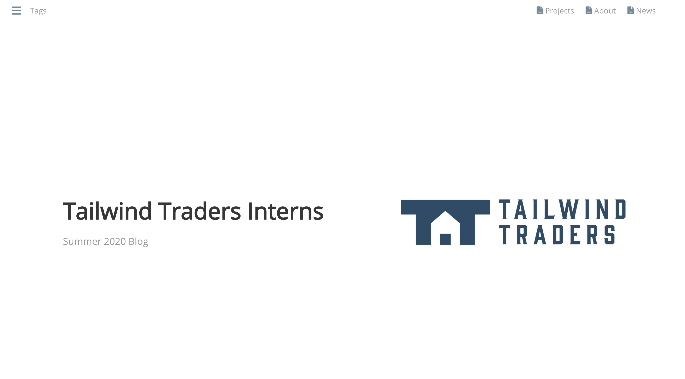

Ensuring smooth deployment of an application typically involves numerous people and procedures - commonly known as DevOps. So what happened when Tailwind Traders brought in a team of interns to improve the their static sites over the summer? Fortunately, DevOps need not be complex. Let's see how the team used Azure Static Web Apps and GitHub Actions to "do the DevOps" and manage a successful project.

This demo provides you with a static hugo blog to demonstrate how GitHub Actions and Azure Static Web Apps work together to provide you with CI/CD expereince with just a few clicks.

## Requirements

* [Hugo](https://gohugo.io/getting-started/installing/)
* [GitHub](https://github.com/)
* CLI - Your local computer or [Azure Cloud Shell](https://docs.microsoft.com/en-us/azure/developer/terraform/get-started-cloud-shell?WT.mc_id=devto-blog-jagord)
* Azure Account - [$200 Free Credit](https://cda.ms/1zH)

---

## Installation, Deployment and more

**Fork, Clone Repo, and enter directory**

[Fork the repository within GitHub](https://docs.github.com/en/github/getting-started-with-github/fork-a-repo).

```bash
git clone git@github.com:jaydestro/twtintern.git
cd twtintern
```

**OPTIONAL - Test local install** (not for Cloud Shell)

The first command will build the static content from the `content/` directory.  The second command will start the demo server locally on your workstation  

```bash
hugo 
hugo server -D 
```

**Output should be**

```@Serving pages from memory
Running in Fast Render Mode. For full rebuilds on change: hugo server --disableFastRender
Web Server is available at http://localhost:1313/ (bind address 127.0.0.1)
Press Ctrl+C to stop
```

Ctrl+C  to Exit.

**Deployment to Azure**

1. open Azure portal, type in search bar "Static Web Apps (Preview)"
2. Click "Add"
3. Select appropriate subscription
4. Create new resource group (Any name will do)
5. Select name (This is not the hostname, this is an identifier, anything will do)
6. Select preferred region
7. Click *Sign in with GitHub* and authenticate your session
8. Select your org (jaydestro for me)
9. Select your repo (twtintern)
10. Select your branch (master)


11. Click Build.
12. leave `/` as App location (this is where the code lives)
13. API Location - leave empty. delete `api`
14. App Artifact location - enter `public` (the location of the static pages)
15. Click "Review and Create"
16. Validate settings and then click "Create"
17. Once deployed go to SWA in portal
18. Click "URL" to see website, click Deployment History and Workflow to see how Actions Build your code


# Changing a file

For example, we'll add code to "`content/news.md`"

(Create branch, enter branch, enter file, add changes such as lorem ipsum)

EX:

```markdon
---
title: "News"
date: 2020-08-25T14:03:11-04:00
draft: "false"
showInMenu: true
tags: "news"
---

## 06-20-2020

Lorem ipsum dolor sit amet, consectetur adipiscing elit. Integer nec odio. Praesent libero. Sed cursus ante dapibus diam. Sed nisi. Nulla quis sem at nibh elementum imperdiet. Duis sagittis ipsum. Praesent mauris. Fusce nec tellus sed augue semper porta. Mauris massa. Vestibulum lacinia arcu eget nulla. 
```

Save file changes. Enter repository root in your shell and render the static pages from your change using the `hugo` command:


Merge PR - Commit to master - review new triggered build in GitHub

# Tear Down

Using Azure CLI

```az group delete -n $RESOURCEGROUPNAME```

Using portal

Go to your resource group and select the "delete resource group" button.


